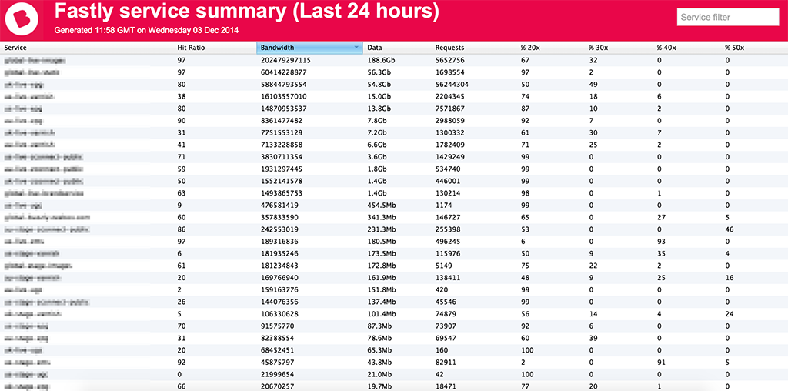

fastlydash
==========

A simple python script that produces a summary of all Fastly services over the past 24 hours, including:

- Service Name
- Hit Ratio
- Bandwidth
- Number of requests
- Percent of 20X, 30X, 40X, and 50X responses

Features
--------

- Filter by service name
- Clickable column headers to sort on an field

And optionally writes a pretty HTML page to S3.

Usage
=====

Install all required dependancies in to a virtualenv:

    pip install -r requirements.txt
    
And run providing an API key, and optionally the name of an S3 bucket:

    python fastlydash.py <API_KEY> --s3bucket beamly-dashboards

Note that the resulting stored HTML file will be publically readable
